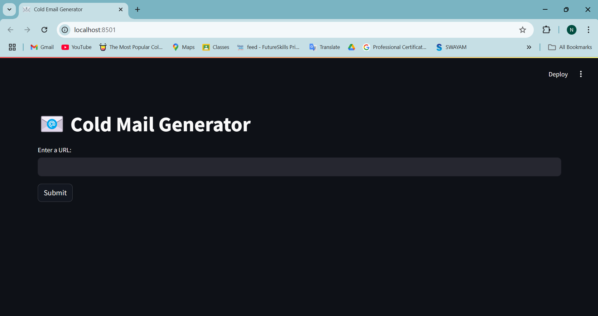
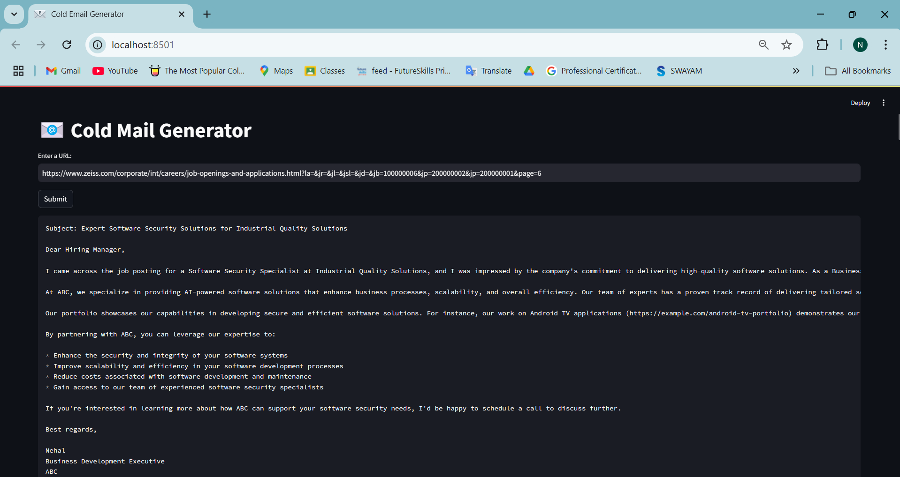

---

# 📧 Cold Mail Generator

The Cold Mail Generator is a tool designed for service-based companies to streamline business outreach using the power of automation. Built with **Groq**, **LangChain**, and **Streamlit**, this tool enables users to extract job listings from a company's careers page and automatically generate personalized cold emails tailored to specific job descriptions. These emails can include relevant portfolio links from a vector database, enhancing relevance and increasing chances of a response.

## **How it works:**

**Imagine this scenario:**

Nike is searching for a **Principal Software Engineer**. They've dedicated significant time and resources to the hiring process, including onboarding, training, and recruitment. At the same time, ABC, a software development company, has engineers ready to step in.

With this tool, ABC's business development executive, **Nehal**, can quickly generate a highly personalized cold email to pitch a dedicated software development engineer to Nike, saving Nike time and resources.

## **Key Features:**
- **Automated Job Scraping**: Input the URL of a company’s careers page, and the tool extracts all the active job listings.
- **Cold Email Generation**: Generate a personalized email using the scraped job information, tailored to the job title and description.
- **Portfolio Integration**: Automatically pull relevant portfolio links from a vector database to add credibility and context to the email.

## **Screenshots:**

### Home Page


### Email Generation Example


## **Architecture Overview:**

The tool follows a simple, yet effective architecture that allows job data extraction, integration with external APIs, and email generation.


## **Set-up Instructions:**

Follow these steps to set up and run the Cold Mail Generator on your local machine.

### 1. **API Key Setup**
To begin, you'll need an API key from Groq. Follow these steps:

- Visit [Groq Console](https://console.groq.com/keys) and generate your API key.
- Add the API key to your environment file. Inside `app/.env`, update the `GROQ_API_KEY` value with the key you generated.

### 2. **Install Dependencies**
Make sure you have all the necessary dependencies by running the following command:

```bash
pip install -r requirements.txt
```

### 3. **Run the Streamlit App**
Once the dependencies are installed, launch the app with:

```bash
streamlit run app/main.py
```

---

By following these steps, you should be able to get the Cold Mail Generator up and running quickly.

---